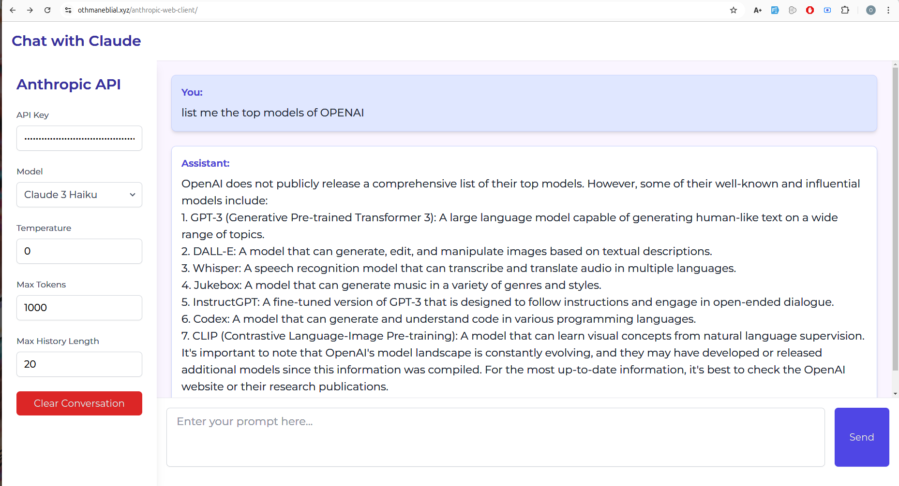

# Anthropic API Web Client

This project is a web client for the Anthropic API, allowing users to interact with Claude, an AI assistant.

## DEMO

https://www.othmaneblial.xyz/anthropic-web-client/



## Features

- Chat interface for communicating with Claude
- Support for multiple Claude models
- Customizable API settings (temperature, max tokens)
- Code highlighting for code blocks in responses
- Conversation history management

## Getting Started

### Prerequisites

- Node.js (v14 or later recommended)
- npm (comes with Node.js)

### Installation

1. Clone the repository:

   ```
   git clone https://github.com/yourusername/anthropic-web-client.git
   ```

2. Navigate to the project directory:

   ```
   cd anthropic-web-client
   ```

3. Install dependencies:

   ```
   npm install
   ```

4. Start the development server:

   ```
   npm start
   ```

5. Open your browser and navigate to `http://localhost:3000` (or the port specified by your development server).

## Usage

1. Enter your Anthropic API key in the sidebar.
2. Select the desired Claude model.
3. Adjust temperature and max tokens as needed.
4. Type your message in the prompt box and click "Send" or press Enter.
5. View Claude's response in the chat interface.

## Development

- Run tests: `npm test`
- Lint code: `npm run lint`

## Contributing

Contributions are welcome! Please feel free to submit a Pull Request.

## License

This project is licensed under the MIT License - see the [LICENSE](LICENSE) file for details.
